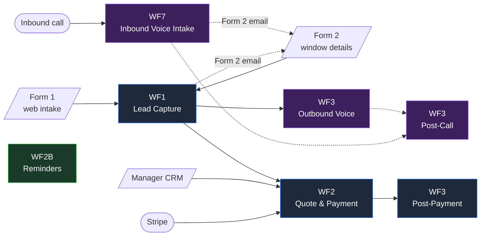

# quote-to-cash workflow automation

> An end-to-end **lead-to-payment** automation pipeline for a Texas
> window-replacement business in the Dallas–Fort Worth metro. Seven
> n8n workflows, AI-driven quote generation, voice agents on inbound
> and outbound calls, and a Stripe payment loop — replacing a 100%
> manual sales cycle with a system the sales manager only touches once
> per deal, to approve a quote.

[](https://n8n.io)
[](https://supabase.com)
[](https://www.anthropic.com)
[](https://openai.com)
[](https://elevenlabs.io)
[](https://twilio.com)
[](https://stripe.com)
[](https://developer.mozilla.org/en-US/docs/Web/JavaScript)
[](https://developer.mozilla.org/en-US/docs/Web/HTML)
[](https://python.org)
[](https://www.postman.com)
[](LICENSE)

---

## At a glance

- **7 n8n workflows · ~347 nodes** wired end-to-end across the funnel.
- **9 Supabase tables · 17 webhooks** form the system's data backbone.
- **12+ external integrations:** Anthropic Claude, OpenAI GPT-4,
  ElevenLabs, Twilio, Stripe, Google Calendar, Google Sheets, PDFShift,
  Gmail / SMTP, HubSpot, Supabase Storage.
- **Two ways into the funnel** — web form *or* an inbound phone call
  routed through an ElevenLabs agent that collects the same intake
  fields by voice.
- **One human touchpoint by design:** the sales manager approves a
  quote in the CRM. Everything else — estimate generation, customer
  email, follow-ups, payment, post-sale review — is automated.

🎥 **5-minute walkthrough:** [Loom video](https://www.loom.com/share/edfbc9e1e76b41e0be5fb3d06a5ef9cb)

---

## System architecture



For the full architecture (data model, design decisions, security
debt), see [`docs/architecture.md`](docs/architecture.md).

---

## How it works

**1. Lead arrives.** A customer either submits the
[lead intake form](frontends/lead-intake/index.html) or dials the
company's Twilio number. The web form posts to `/apex-lead-v2` (entry
to [WF1](docs/workflows/wf1-lead-capture.md)). The inbound call routes
through an ElevenLabs voice agent that collects the same intake fields
by voice and posts them to `/inbound-lead`
([WF7](docs/workflows/wf7-inbound-call.md)). Either path produces a
`leads` row in Supabase and an emailed link to Form 2.

**2. Outbound voice agent dispatches in parallel.** WF1 fires a
fire-and-forget POST to [WF3 Outbound](docs/workflows/wf3-outbound-call.md),
which checks the time of day. During business hours an ElevenLabs agent
calls the customer; outside business hours, a Twilio SMS goes out
instead, with the Form 2 link.

**3. AI estimate from photos and notes.** The customer fills out
[Form 2](frontends/window-details/index.html) — per-window photo
uploads with free-text notes, but no width/height/glass-type fields by
design. WF1's window-details branch uploads photos to Supabase Storage,
loads the editable `pricing_config` table, calls Claude for a structured
line-item estimate, renders the result through PDFShift to a branded
PDF, and emails the sales manager.

**4. SM approves once.** The
[manager portal CRM](frontends/crm/index.html) shows the queued quote.
The SM clicks Approve (with optional price adjustment). That fires
[WF2 sub-flow B](docs/workflows/wf2-quote-and-payment.md#sub-flow-b--manager-approved-manager-approved),
which sends the customer a quote email containing two **magic-link
URLs** (256-bit acceptance tokens — no login required) and inserts two
escalation rows so [WF2B](docs/workflows/wf2b-reminders.md) and
[WF3 Post-Payment](docs/workflows/wf3-post-payment.md) can chase
non-responses.

**5. Customer accepts in one click.** The accept link hits a GET
webhook, validates the token, transitions `quotes.status` to `accepted`,
and shows a thank-you page. Decline does the same in reverse. After
the install, the SM marks the job complete in the CRM, which fires
[WF2 sub-flow D](docs/workflows/wf2-quote-and-payment.md#sub-flow-d--job-completed-job-completed)
to generate an invoice (`APX-YYYY-XXXX`), create a Stripe Payment Link,
and email the customer.

**6. Payment closes the loop.** Stripe's
`checkout.session.completed` webhook fires WF2 sub-flow E, which marks
the invoice paid, transitions the lead to `Closed Won`, and triggers
[WF3 Post-Payment](docs/workflows/wf3-post-payment.md) — which waits
30 minutes (so the payment-confirmed email lands first), then sends a
Google review request. A duplicate guard via `post_job_comms` makes
the same call idempotent if the hourly cron also fires it.

**7. The escalation engine watches everything else.** A unified
`escalations` table holds anything timed: SM approvals overdue >24h,
customer hasn't responded to a quote in 72h, payment reminders. The
hourly cron in WF3 Post-Payment scans this table with cooldown gating,
escalating to "Closed Lost candidate" alerts after three contacts.

---

## What's in this repo

```text
quote-to-cash-workflow-automation/
├── README.md                  ← you are here
├── LICENSE                    ← MIT
├── docs/
│   ├── architecture.md        ← system overview, data model, design decisions
│   ├── frontends.md           ← walkthrough of the three HTML pages
│   ├── workflows/             ← per-workflow design docs (one per workflow)
│   │   ├── README.md
│   │   ├── wf1-lead-capture.md
│   │   ├── wf2-quote-and-payment.md     ← deepest treatment
│   │   ├── wf2b-reminders.md
│   │   ├── wf3-outbound-call.md
│   │   ├── wf3-post-call.md
│   │   ├── wf3-post-payment.md
│   │   └── wf7-inbound-call.md
│   └── reference/             ← original project context + delivery PDFs
│       ├── APEX_CONTEXT.md
│       ├── ApexWindows_AutomationSystem_Documentation.pdf
│       └── WindowReplacementCo_AutomationSystem_Documentation.pdf
├── frontends/
│   ├── lead-intake/index.html       ← Form 1 (customer first touch)
│   ├── window-details/index.html    ← Form 2 (per-window upload)
│   └── crm/index.html               ← Manager portal
└── workflows/                 ← sanitized n8n JSON exports
    ├── wf1-lead-capture.json
    ├── wf2-quote-and-payment.json
    ├── wf2b-reminders.json
    ├── wf3-outbound-call.json
    ├── wf3-post-call.json
    ├── wf3-post-payment.json
    └── wf7-inbound-call.json
```

---

## Engineering highlights

A few design moves worth opening if you want a deeper read on the
trade-offs:

- **Magic-link acceptance tokens** — 256-bit random tokens stored on
  the quote row, with the `status` column doing double duty as the
  state machine *and* the link's revocation flag. No sessions, no
  cookies, no expiry job.
  [details →](docs/workflows/wf2-quote-and-payment.md#magic-link-acceptance-token--the-auth-pattern-in-detail)
- **Nine webhooks under one workflow** — WF2 holds the entire quote
  lifecycle in a single editor view because all nine sub-flows share
  the same lead/quote/estimate fetch helpers. n8n quirks force every
  webhook into `responseMode: onReceived`.
  [details →](docs/architecture.md#42-one-workflow-many-webhooks)
- **Unified escalation scheduler** — one `escalations` table with a
  `type` column instead of per-workflow queues. Adding a new timed
  reminder is one INSERT and one filter clause.
  [details →](docs/architecture.md#43-escalation-table-as-a-unified-scheduler)
- **AI estimate from photos + notes** — Form 2 collects no width /
  height / glass-type fields. Claude infers what it needs from the
  photos and customer-written notes, with `pricing_config` as the
  price floor. Manual SM adjustment is supported via
  `quotes.adjusted_total`.
  [details →](docs/workflows/wf1-lead-capture.md#flow-b-window-details-and-ai-estimate-apex-window-details-v2)
- **Voice agent webhook chain** — inbound and outbound voice agents
  share one toolset (booking, availability, status) backed by webhooks
  in WF3 Post-Call. The inbound agent additionally captures `lead_id`
  via ElevenLabs Dynamic Variable Assignment and threads it through
  every subsequent tool call in the same conversation.
  [details →](docs/workflows/wf7-inbound-call.md#response-back-to-the-agent)
- **Documented bugs over hidden ones** — the design docs include
  callouts on real bugs that took real time to find (the
  `$json.body.lead_id` vs `$json.lead_id` cross-trigger payload bug,
  the empty-calendar / past-date LLM bug pair). They're more useful
  than a frictionless walkthrough.

---

## Built with Claude Code

Parts of this project were built with
[Claude Code](https://www.anthropic.com/claude-code) as a development
tool — particularly during the n8n node wiring and the back-and-forth
between architecture and implementation. The system design, the
debugging, and the integration decisions are mine; Claude Code was
the keyboard. I mention it because being upfront about how I work is
more useful than hiding it, and AI-augmented engineering workflows
are a tooling choice worth knowing about.

---

## Status

Built for a paying client. All seven workflows are deployed and active
in production. There is a prioritized list of known bugs and security
debt in
[`docs/reference/APEX_CONTEXT.md`](docs/reference/APEX_CONTEXT.md) §7–§9,
kept openly because honest internal docs are more useful than
optimistic ones.

This repo is a portfolio showcase, not a runnable replica — the
sanitized JSON exports and HTML files won't import or deploy without
re-binding credentials and replacing the `{{N8N_BASE_URL}}` /
`{{SUPABASE_PROJECT_URL}}` / Stripe / Gmail / OpenAI placeholders.

---

## Contact

**Samarth Kumar**
✉ [samarth.kumar2901@gmail.com](mailto:samarth.kumar2901@gmail.com)
🔗 [linkedin.com/in/samarth-kr](https://www.linkedin.com/in/samarth-kr/)

If you're a recruiter or hiring manager and want a deeper walkthrough
than the docs here, the
[Loom video](https://www.loom.com/share/edfbc9e1e76b41e0be5fb3d06a5ef9cb)
covers the system end-to-end in five minutes.
