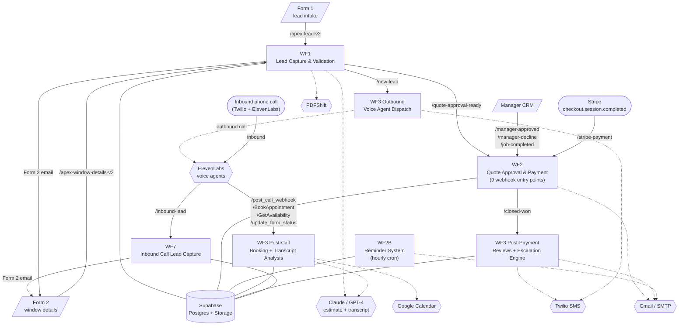
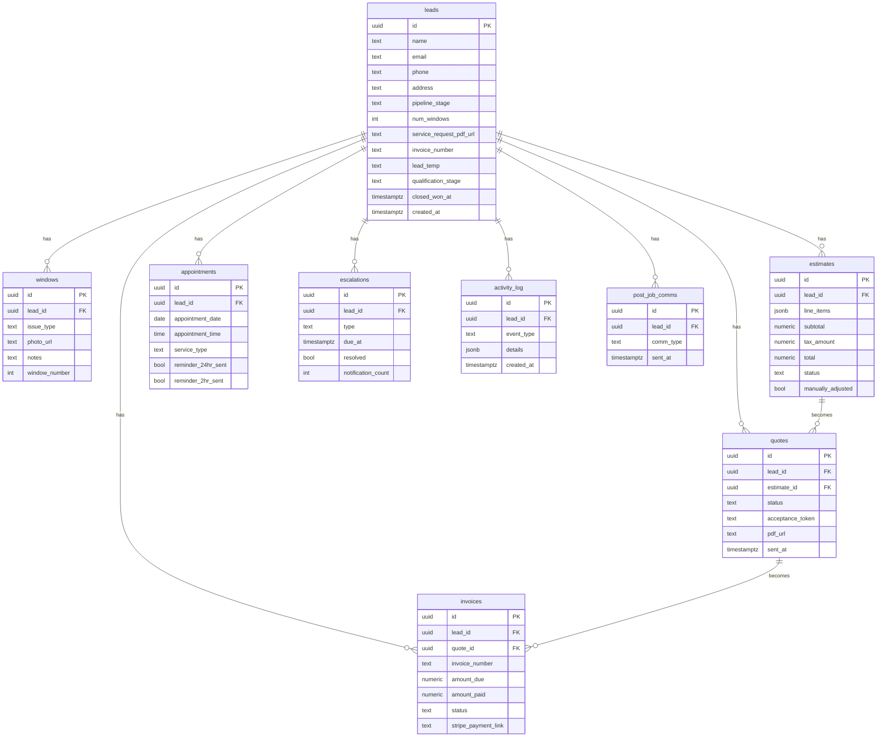

# Architecture

[← back to README](../README.md)

This document covers the system at three levels: the workflow chain, the
data model, and the design decisions worth calling out.

---

## 1. System overview

The pipeline turns a web-form submission (or an inbound phone call) into a
booked, paid job, with a sales manager touching the process exactly once —
to approve a quote. Everything else is wired together as event-driven n8n
workflows talking over HTTP webhooks, with Supabase as the system of record.



**Two ways into the funnel.** Customers either submit Form 1 (which fires
WF1) or call the inbound number (which routes through ElevenLabs to WF7).
WF7 creates the lead row and emails Form 2 directly to the caller; from
that point, both paths converge on Form 2.

**Form 2 is where the AI estimate is generated.** WF1's window-details
branch reads the photos and notes, fetches the pricing config, calls
Claude for a structured line-item estimate, renders that to PDF via
PDFShift, and emails the sales manager.

**WF2 carries the most weight.** Nine webhooks under one workflow — quote
queue, manager approve, manager decline, customer accept, customer
decline, job complete, manual payment, Stripe payment, plus the GET
landing pages for the customer's accept/decline links. The deepest
treatment is in [docs/workflows/wf2-quote-and-payment.md](workflows/wf2-quote-and-payment.md).

**Two kinds of background loops.** WF2B fires hourly and walks the
escalation table to send quote/payment reminders (and auto-decline a
quote on day 3). WF3 Post-Payment fires hourly *and* on the
`/closed-won` webhook to send Google review requests, run a quarterly
newsletter, and act as a watchdog for SM-overdue and customer-no-response
escalations.

---

## 2. Data model

Postgres on Supabase. Nine tables; `leads.id` is the master FK that every
other table hangs off.



A 10th table, `pricing_config`, holds the editable base prices that get
loaded into the Claude prompt at estimate time — not lead-scoped, so it
sits outside the diagram.

The `leads.pipeline_stage` column is a string-valued state machine. Its
canonical values flow as:

```text
New Lead                              ─┐
                                       ├─► Window Details Received ─► Estimate Generated
Inbound Call - Form 2 Pending         ─┘                                      │
                                                                              ▼
                                               Quote Pending Approval ─► Quote Sent
                                                                              │
                          Closed Lost ◄─ (3-day no-response auto-decline)     │
                                                                              ▼
                                                                       Quote Accepted
                                                                              │
                                                                              ▼
                                  Closed Won ◄─ Payment Pending ◄─ Completed
```

The strings are exact — typos silently break WF2B and WF3 filter queries
that scan for active leads.

---

## 3. Inter-workflow communication

Workflows talk to each other in exactly one way: HTTP webhooks on the same
n8n instance. There is no shared state in memory and no message queue.

```text
WF1 ──POST /quote-approval-ready──► WF2
WF1 ──POST /new-lead─────────────► WF3 Outbound
WF2 ──POST /closed-won───────────► WF3 Post-Payment
CRM ──POST /manager-approved─────► WF2
CRM ──POST /manager-decline──────► WF2
CRM ──POST /job-completed────────► WF2
ElevenLabs ──POST /inbound-lead──► WF7
ElevenLabs ──POST /post_call_webhook ──► WF3 Post-Call
ElevenLabs ──POST /BookAppointment ───► WF3 Post-Call
ElevenLabs ──POST /GetAvailability ───► WF3 Post-Call
ElevenLabs ──POST /update_form_status ► WF3 Post-Call
```

**Why this pattern, not sub-workflow calls.** n8n's `Execute Workflow`
node ties the parent and child to one execution context — long-running
work in the child blocks the parent's response. Splitting on HTTP makes
each workflow independently observable in n8n's execution log, lets each
have its own retry policy, and lets the customer-facing webhook respond
within the 10-second window even when downstream work takes minutes.

**Trade-off this creates.** The payload contract between workflows is
implicit. `WF1 → WF2` passes `{lead_id, estimate_id, pdf_url, total}`;
that contract isn't enforced anywhere except by reading the receiving
workflow. A bug from this exact failure mode is documented in
[docs/workflows/wf2-quote-and-payment.md](workflows/wf2-quote-and-payment.md#engineering-challenge-the-jsonbodylead_id-vs-jsonlead_id-bug)
— `$json.body.lead_id` vs. `$json.lead_id` differs depending on whether
the webhook was hit by an external curl or an internal n8n HTTP Request
node.

---

## 4. Key design decisions

### 4.1 Magic-link acceptance tokens

When the sales manager approves a quote, the system needs the customer to
accept it from their email — without a login. The pattern:

1. WF2 generates a 64-character hex token via `crypto.randomBytes(32)` —
   that's 256 bits of entropy.
2. The token is stored on `quotes.acceptance_token`, alongside
   `status = 'sent'`.
3. The customer email contains two URLs:
   `…/quote/accept?token={token}` and `…/quote/decline?token={token}`.
4. Clicking the link hits a GET webhook that validates the token by
   selecting the row where `acceptance_token = ? AND status = 'sent'`.
   No session, no cookie, no auth header.

The token *is* the customer's identity for the duration of the action.
`status = 'sent'` in the WHERE clause means the link becomes a no-op once
used — no extra revocation logic needed.

### 4.2 One workflow, many webhooks

WF2 runs nine separate webhook entry points under a single workflow
definition. Each webhook is the head of an independent flow that shares
the same set of helper sub-paths (e.g., "fetch lead by id"). The
alternative — splitting into nine workflows — would have meant nine
copies of the helper logic and nine places to update if the schema
changes. Keeping them under one definition makes the quote lifecycle
auditable in a single n8n editor view.

This pattern has a known n8n quirk: `responseMode: onReceived` is required
on every webhook, because adding `Respond to Webhook` nodes to a
multi-webhook workflow trips a validation bug in the n8n version this was
built on. All flows therefore respond 200 immediately and do their work
asynchronously.

### 4.3 Escalation table as a unified scheduler

Instead of giving each workflow its own queue, the system has one
`escalations` table with a `type` column and a `due_at` timestamp.
Anything that needs to fire later — quote approval still pending after
24 hours, customer hasn't accepted in 72 hours, payment overdue, post-job
review request — gets a row.

WF2B and WF3 Post-Payment scan this table on an hourly cron with cooldown
filters (12 hours between SM nudges, 24 hours between customer nudges,
notification-count gating to escalate to closed-lost candidates after
three contacts). Adding a new kind of timed reminder means adding an
`INSERT INTO escalations` somewhere and a new `type` filter in the
scheduler — no new cron, no new workflow.

### 4.4 AI estimate from photos + free-text notes

The window-details form deliberately collects no width, height, or glass
type. Instead it collects per-window photos and customer-written notes,
which Claude turns into a structured line-item estimate using the
editable `pricing_config` table as the price floor. Trade-off:
estimates sometimes need manual SM adjustment (the `quotes.adjusted_total`
+ `manually_adjusted` flag exists for this) — but the form is short
enough that customers actually finish it.

### 4.5 Voice agent webhook contract

Both the inbound and outbound ElevenLabs agents share the same set of
tools — `BookAppointment`, `GetAvailability`, `update_form_status`,
`transfer_unavailable_handler` — backed by webhooks in WF3 Post-Call.
The inbound agent additionally has `create_lead` (WF7), because the lead
doesn't pre-exist for a cold inbound call.

The agent uses ElevenLabs Dynamic Variable Assignment to capture
`lead_id` from `create_lead`'s response and pass it as a dynamic variable
to all subsequent tool calls in the same conversation. Once Form 2 is
submitted, the customer rejoins the standard pipeline at WF1's
window-details branch, and the inbound and web paths are indistinguishable
from there on.

### 4.6 Idempotent post-sale comms

Both WF2's `/closed-won` webhook and WF3 Post-Payment's hourly cron can
fire a Google review email for the same lead — by design, so a missed
webhook isn't a missed review. The duplicate guard is the
`post_job_comms` table: every send writes a row, and every send first
checks `WHERE lead_id = ? AND comm_type = 'review_request' NOT IN`. Same
pattern for the quarterly newsletter.

---

## 5. Known security debt

These were tracked openly in the project's own context document and are
listed here so the architecture is read with eyes open. None are blockers
for the workflow logic; all need to be cleared before a real production
hand-off.

| # | What | Where | Why it matters |
|---|---|---|---|
| 1 | Stripe SK hardcoded in node config | WF2 Stripe price/payment-link nodes | should live in n8n credential store |
| 2 | Supabase service-role JWT hardcoded in HTTP nodes | a handful of direct PATCH calls in WF2/WF3 | introduced because the n8n Supabase node lacked PATCH support at build time; needs to move to env |
| 3 | CRM page has no auth | manager portal HTML | publicly accessible by URL |
| 4 | Supabase anon key shipped to browser | CRM HTML | RLS is configured but the key is exposed in source |
| 5 | CRM Decline button bypasses n8n | CRM HTML | direct Supabase PATCH — no SM email, no activity_log; the `/manager-decline` n8n webhook now exists in WF2, the CRM hasn't been switched over yet |

---

[← back to README](../README.md)
